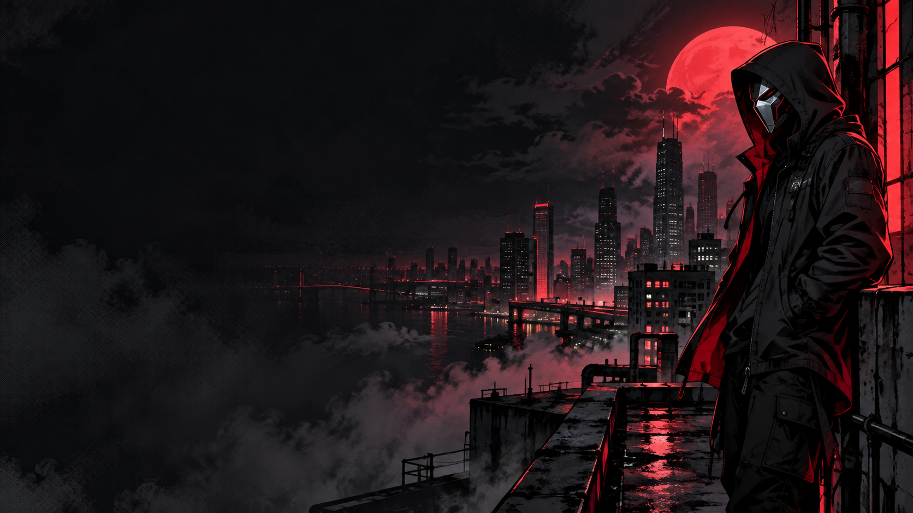

# Things To Doooo

Eine ToDo-App mit React und Tailwind CSS im düsteren Comic-Look. Organisiere deine Aufgaben vor einer rot-schwarzen Skyline – mit transparenten Karten, einer eigenen Comicfigur und passendem Masken-Favicon.



## Funktionen

- Neue Aufgaben hinzufügen
- Aufgaben als erledigt markieren und wieder aktivieren
- Nach **All**, **Active** und **Completed** filtern
- Leere Eingaben werden abgefangen
- Responsive Gestaltung für Desktop und Smartphone
- Rot-schwarzes Design mit transparenten Karten und lokalem Hintergrundbild
- Eigenes SVG-Favicon passend zum Comic-Stil

## Technologien

| Technologie | Verwendung |
| --- | --- |
| React 19 | Komponenten und Verwaltung der Aufgaben mit `useState` |
| Tailwind CSS 4 & CSS | Styling und responsive Gestaltung |
| Vite 8 | Entwicklungsserver und Produktionsbuild |
| Oxlint | Prüfung des JavaScript-Codes |

## Lokal starten

Voraussetzung: Node.js in einer mit Vite 8 kompatiblen Version und npm.

Öffne ein Terminal im Projektordner und installiere die Abhängigkeiten:

```bash
npm install
```

Starte anschließend die App:

```bash
npm run dev
```

Öffne die im Terminal angezeigte lokale Adresse im Browser.

## Weitere Befehle

| Befehl | Zweck |
| --- | --- |
| `npm run build` | Produktionsbuild im Ordner `dist` erstellen |
| `npm run preview` | Den zuvor erstellten Build lokal ansehen |
| `npm run lint` | Code mit Oxlint prüfen |

## Projektstruktur

```text
public/
└── favicon.svg          # Masken-Favicon
src/
├── components/
│   ├── AddToDo.jsx      # Neue Aufgaben anlegen
│   ├── FilterComponent.jsx # Aufgaben filtern
│   ├── ToDoItem.jsx     # Einzelne Aufgabe mit Checkbox
│   └── ToDoList.jsx     # Aufgabenliste anzeigen
├── App.jsx              # Aufgaben, Filter und Layout
├── comic-background.png # Lokal eingebundenes Hintergrundbild
├── index.css            # Tailwind und Comic-Styling
└── main.jsx             # Einstiegspunkt
```

## Daten speichern

Aktuell werden Aufgaben im React-State gespeichert. Beim Neuladen der Seite wird die Liste zurückgesetzt. Eine dauerhafte Speicherung mit Local Storage oder einem Backend ist noch nicht integriert.

## Design

Der Comic-Hintergrund wurde mit KI generiert und zeigt eine eigene Figur vor einer nächtlichen Skyline. Das Masken-Favicon greift die silbernen und roten Akzente des Motivs auf. Beide Grafiken sind lokal im Projekt eingebunden.

## Lernprojekt

Dieses Projekt übt die Aufteilung einer React-App in Komponenten, den Umgang mit State und Props sowie das Hinzufügen, Aktualisieren und Filtern von Aufgaben.
